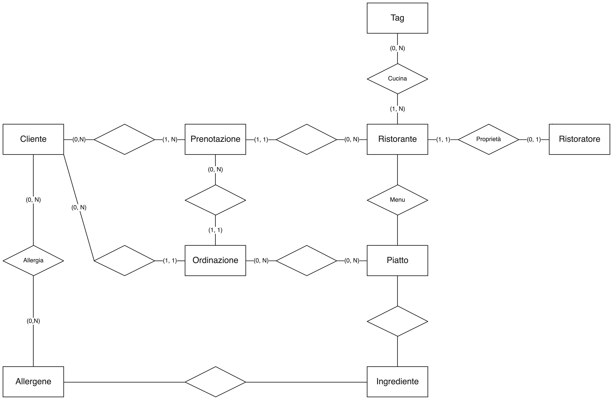
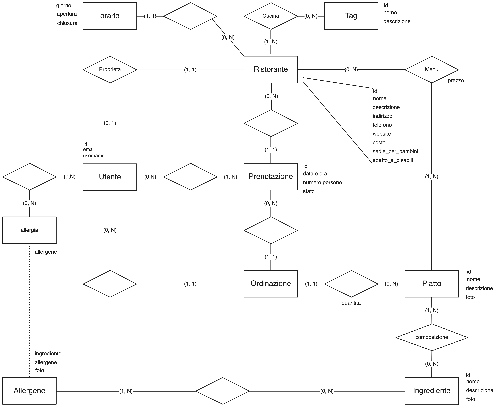

# Database

## Come progettare un Database

Le attività si dividono come segue:
1. Analisi dei requisiti: 
    1. Individuazione delle entità
    1. Individuazione delle proprietà delle entità
    1. Completare la descrizione delle entità aggiungendo i vincoli opportuni
    1. Definizione dei termini (Glossario)
    1. Definizione delle operazioni

1. Progettazione concettuale:
    1. Identificazione delle chiavi primarie
    1. Identificazione delle chiavi secondarie
    1. Analisi delle relazioni ((1, N), (1, 1), (N, N), ...)
    1. Schema concettuale
    1. Vincoli non rappresentabili nello schema

1. Progettazione logica:
    1. Analisi delle ridondanze
    1. Identificazione delle chiavi primarie

1. SQL:
    Avendo completato tutti i passaggi precedenti, scrivere le entità in SQL
    dovrebbe diventare piuttosto intuitivo. Dopo aver scritto le tabelle si
    procede con la stesura delle _queries_.

## Analisi dei requisiti

### Individuazione delle entità

- Cliente: rappresenta l'utente che può prenotarsi in un ristorante.
- Ristoratore: rappresenta l'utente che gestisce un ristorante.
- Ristorante: rappresenta un ristorante in cui i clienti possono prenotarsi.
- Prenotazione: rappresenta la prenotazione in un ristorante.
- Ordinazione: rappresenta l'elenco delle pietanze riferito ad un'ordinazione.
- Piatto: rappresenta un piatto ordinabile in un ristorante.
- Ingrediente: rappresenta una delle componenti che compone un piatto
- Allergene: rappresenta un ingrediente che può causare allergie.
- Tag: rappresenta una delle tipologie di piatti di un ristorante.

### Individuazione delle proprietà delle entità e vincoli

#### Cliente
Rappresenta l'utente che può prenotarsi in un ristorante ed effettuare un
ordine. Ogni utente è caratterizzato dai seguenti dati:

- email
- nome utente
- collegamenti:
    - prenotazione
    - ordinazione
    - allergene

#### Ristoratore
Rappresenta l'utente che gestisce un ristorante. Può modificare le informazioni
relative al proprio ristorante e può accettare o rifiutare una prenotazione.
Ogni ristoratore è caratterizzato dai seguenti dati:

- email
- nome utente
- collegamenti:
    - ristorante

#### Ristorante
Rappresenta un ristorante in cui i clienti possono prenotarsi.
Ogni ristorante è caratterizzato dai seguenti dati:

- nome
- orario
- descrizione
- indirizzo
- recapiti
- website
- costo
- sedie per bambini
- adatto a persona con ridotta mobilità
- collegamenti:
    - ristoratore
    - tag
    - piatto

#### Prenotazione
Rappresenta la prenotazione in un ristorante. Un cliente può effettuare una
prenotazione presso un ristorante. Un ristoratore può gestire le prenotazioni
inerenti al proprio ristorante.
Ogni prenotazione è caratterizzata dai seguenti dati:

- data
- ora
- numero persone
- stato
- collegamenti:
    - ristorante
    - utente
    - ordinazione

#### Ordinazione
Rappresenta l'elenco delle pietanze riferito ad un'ordinazione.
Ciascun utente che ha una prenotazione, può aggiungere dei piatti ad essa.
Ogni ordinaizone è caratterizzata dai seguenti dati:

- costo parziale
- collegamenti:
    - utente
    - prenotazione
    - piatto

#### Piatto
Rappresenta un piatto ordinabile in un ristorante, dunque inseribile in 
un'ordinazione.
I piatti sono gestiti dal ristoratore. 
Ogni piatto è caratterizzato dai seguenti dati:

- foto
- nome
- descrizione
- prezzo
- collegamenti:
    - ingrediente
    - ristorante

#### Ingrediente
Rappresenta una delle componenti che compone un piatto.
Ogni ingrediente è caratterizzato dai seguenti dati:

- foto
- nome
- descrizione
- prezzo/quantità
- collegamenti:
    - piatto
    - allergene

#### Allergene
Rappresenta un ingrediente che può causare allergie.
Ciascun cliente può indicare le sostanze di cui è allergico. In fase di
ordinazione saranno segnalati i piatti che il cliente non può mangiare
Ogni allergene è caratterizzato dai seguenti dati:

- nome
- descrizione
- foto
- collegamenti:
    - piatto
    - utente
    - ingrediente

#### Tag

- nome
- descrizione
- collegamenti:
    - ristorante

### Glossario dei termini

| Termine | Descrizione | Collegamenti |
| - | - | - |
| cliente | utente che può prenorasi in un ristorante e può effettuare un ordine |prenotazione, ordinazione e allergene |
| ristoratore | utente che gestisce un ristorante | ristorante |
| ristorante | luogo dove un cliente può prenotarsi e può effettuare un ordine | ristoratore, prenotazione e tag |
| prenotazione | data e ora e numero di persone | ristorante, utente e ordinazione |
| ordinazione | lista di piatti ordinati da un cliente | utente e prenotazione |
| piatto | alimento che può essere ordinato da un cliente | ingrediente e ristorante |
| ingrediente | alimento che può essere contenuto in un piatto | piatto e allergene |
| allergene | ingrediente che può causare allergie | utente e ingrediente |
| tag | tipologia di piatti che un ristorante offre ai clienti | ristorante |

### Operazioni

| Operazione | Tipo | Frequenza |
| - | - | - |
| Inserimento di un nuovo utente | E | 100 volte in un giorno |
| Inerimento di un ristorante | R | 1 volta in un giorno |
| Inserimento di una prenotazione | C | 10000 volte in un giorno |
| Modifica di una prenotazione | C | 100 volte in un giorno |
| Inserimento di un'ordinazione | C | 8000 volte in un giorno |
| Modifica di un'ordinazione | C | 500 volte in un giorno |
| Visione di una prenotazione | C/R | 30000 volte in un giorno |
| Inserimento di un nuovo piatto | R | 10 volte in un giorno |
| Visione degli ingredienti richiesti | R | 50000 volte in un giorno |
| Calcolo del guadagno quotidiano | R | 10000 volte al giorno |
| Calcolo del guadagno mensile | R | 50000 volte in un mese |

## Progettazione concettuale

### Lista delle entità

#### Cliente

- _email_ VARCHAR(255) PK NOT NULL
- username VARCHAR(100) NOT NULL

#### Ristoratore

- _email_ VARCHAR(255) PK NOT NULL
- username VARCHAR(100) NOT NULL

#### Ristorante

- nome VARCHAR(100) NOT NULL
- orario JSON NOT NULL
- descrizione VARCHAR(511)
- _indirizzo_ VARCHAR(255) PK NOT NULL
- telefono VARCHAR(10)
- website VARCHAR(255)
- costo COST NOT NULL
- sedie_per_bambini BOOLEAN NOT NULL
- adatto a persona con ridotta mobilità BOOLEAN NOT NULL

<!-- Todo! ENUM COST -->

#### Prenotazione

- _data e ora_ TIMESTAMP PK NOT NULL
- numero persone INT NOT NULL
- stato STATO_ORDINE NOT NULL
- _id utente_ INT PK NOT NULL
- _id ristoratore_ INT PK NOT NULL
- costo totale INT

<!-- numero persone >= 0 -->
<!-- costo totale >= 0 -->
<!-- Todo! ENUM STATO_ORDINE -->

#### Ordinazione

- _id utente_ INT PK NOT NUL
- _id prenotazione_ INT PK NOT NULL
- costo parziale INT NOT NULL

<!-- costo parziale >= 0 -->

#### Piatto

- _nome_ VARCHAR(255) PK NOT NULL
- _id ingrediente_ INT PK NOT NULL
- descrizione VARCHAR(255)
- foto BYTEA

<!-- 
ci possono essere due piatti che hanno gli stessi ingredienti, ma che sono
cucinato in modo diverso:
- pesce al vapore
- pesce fritto
per questo motivo la descrizione diventa parte della primary key
-->

#### Ingrediente
 
- _nome_ VARCHAR(255) PK NOT NULL
- _descrizione_ VARCHAR(255)
- foto BYTEA
- prezzo/quantità FLOAT

#### Allergene

- _ingrediente_ INT PK NOT NULL
- _allergene_ ALLERGENE NOT NULL

<!-- Todo! ENUM ALLERGENE -->

#### Tag

- _nome_ VARCHAR(100) PK NOT NULL
- descrizione VARCHAR(511) PK NOT NULL

Un utente non può effettuare due prenotazioni presso lo stesso ristorante alla
stessa ora

### Tabella delle relazioni

| Relazione | Entità coinvolte | Descrizione | Attributi |
| - | - | - | - |
| Cliente_Prenotazione | Cliente (0,N), Prenotazione (1,N) | Relazione tra Cliente e le sue Prenotazioni | - |
| Ristorante_Prenotazione | Ristorante (0, N), Prenotazione (1, 1) | Relazione tra Ristorante e Prenotazione | - |
| Cliente_Ordinazione | Cliente (0,N), Ordinazione (1,1) | Relazione tra Cliente e le sue Ordinazioni | - |
| Allergia | Cliente (0,N), Allergene (0,N) | Relazione tra Cliente e gli Allergeni | - |
| Proprietà | Ristoratore (0,1), Ristorante (1,1) | Relazione tra Ristoratore e il suo Ristorante | - |
| Cucina | Ristorante (1,N), Tag (0,N) | Relazione tra Ristorante e i Tag | - |
| Prenotazione_Ordinazione | Prenotazione (0,N), Ordinazione (1,1) | Relazione tra Prenotazione e Ordinazione | - |
| Ordinazione_Piatto | Ordinazione (0,N), Piatto (0,N) | Relazione tra Ordinazione e Piatti | quantità INT > 0 |
| Piatto_Ingrediente | Piatto (1,N), Ingrediente (0,N) | Relazione tra Piatti e Ingredienti | - |
| Ingrediente_Allergene | Ingrediente (1,N), Allergene (1,N) | Relazione tra Ingredienti e Allergeni | - |
| Menu | Ristorante(0, N), Piatto (1, N) | I-l menu di un ristorante | prezzo DECIMAL(10, 2) > 0 |

### Schema concettuale

## Progettazione logica

### Eliminazione delle ridondanze

- L'attributo costo parziale dell'entità Ordinazione è ridondante, perché può
  essere calcolato
- L'attributo costo totale dell'entità Prenotazione è ridondante, perché può
  essere calcolato

- Le due entità Cliente e Ristoratore possono essere unite nell'Entità Utente,
  perché hanno gli stessi dati. Le relazioni cambiano di conseguenza, per
  mantenere il medesimo significato

### Scelta degli identificatori primari

Viene aggiunto l'attributo id per le entità:
- Utente
- Ristorante
- Piatto
- Ingrediente
- Prenotazione
- Tag

### Schema logico

### Creazione delle tabelle

$a \rightarrow b$ indica che la chiave di b è chiave esterna di a.

#### creazione delle tabelle

- **utente**(_id_, email, username)
- **ristorante**(_id_ -> utente, nome, orario, descrizione, indirizzo, telefono, website, costo, sedie_per_bambini, adatto_a_persone_a_mobilità_ridotta)
- **prenotazione**(_id_, data_e_ora, numero_persone, stato, utente -> utente, ristorante -> ristorante)
- **tag**(_id_, nome, descrizione)
- **cucina**(_tag_->tag, _ristorante_->ristorante)
- **ordinazione**(_id_utente_->utente, _id_prenotazione_->prenotazione, _id_piatto->piatto, quantità)
- **menu**(_id_ristorante_->ristorante, _id_piatto_->piatto, prezzo)
- **piatto**(_id_, nome, descrizione, foto)
- **composizione**(_id_piatto_->piatto, _id_ingrediente_->ingrediente)
- **ingrediente**(_id_, nome, descrizione, foto)
- **allergene**(_id_ingrediente_, _allergene_, foto)
- **allergia**(_id_utente_->utente, _id_allergene_->allergene)
